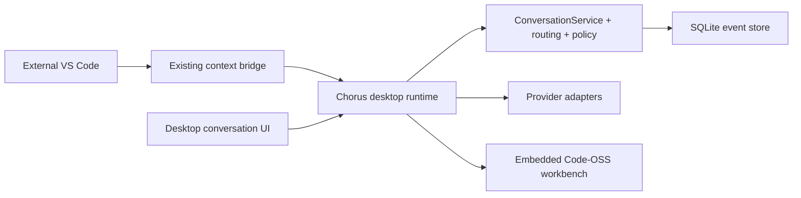
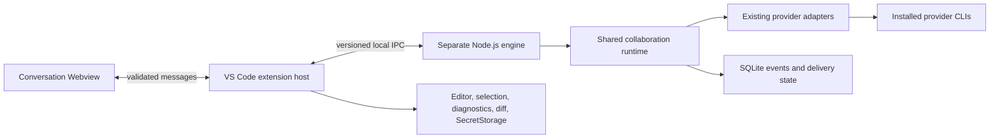
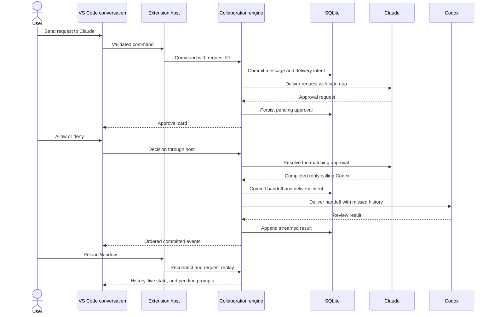

# Chorus for VS Code — Initial Plan

| Field | Value |
| --- | --- |
| Date | 2026-09-23 |
| Target project | `/Users/mohamadtaleb/code/chorus-extension` |
| Source project | `/Users/mohamadtaleb/code/workbench` |
| Reference HEAD | `d471bed447a9f5b9724b6d2a8b35a50e96ea06be` |
| Comparison project | `/Users/mohamadtaleb/code/chorus`, local HEAD `c2847c4ef35451f245bff1c83c1a445766bb2d1c` |
| Status | Milestones 0–3 complete and installed; the product and core decision is made; Milestone 4 is next |
| Core ownership during prototype | Imported source packages and extracted coordinator inside `chorus-extension` |
| First platform | Local desktop VS Code on macOS |
| First proof | Milestones 0–3: two agents, one conversation, a handoff, an approval, an edit, and reconnection after Reload Window |

Build a standalone VS Code extension whose main feature is collaboration between coding agents. Preserve shared history, named handoffs, provider sessions, approvals, and interruption. VS Code supplies the editor, Explorer, terminal, SCM, and debugger.

نبني VS Code extension مستقلة تكون ميزتها الأساسية هي الـ collaboration بين coding agents. نحافظ على الـ shared history، والـ named handoffs، والـ provider sessions، والـ approvals، والـ interruption. ويوفّر VS Code الـ editor، والـ Explorer، والـ terminal، والـ SCM، والـ debugger.

This is an architecture and delivery plan. The current deliverable is this document. Both inspected source repositories contain uncommitted changes; their reference HEADs do not capture those changes. Select the import baseline from committed history and separately review any additional patches. Source comparison here covers local checkouts, not an assertion about the latest remote branches.

هذه architecture و delivery plan. الـ deliverable الحالية هي هذا المستند. تحتوي كلتا الـ source repositories المفحوَصتين على تغييرات دون commit؛ لذلك لا تشمل الـ reference HEADs تلك التغييرات. نختار الـ import baseline من الـ committed history ونراجع أي patches إضافية بصورة منفصلة. تغطّي الـ source comparison هنا الـ local checkouts، ولا تدّعي وصف أحدث الـ remote branches.

## Current / Issue



| Existing source | Observed behavior | Consequence |
| --- | --- | --- |
| `apps/vscode-extension/README.md`, `apps/vscode-extension/src/extension.ts` | Sends editor context to a running Chorus app; manifest uses `extensionKind: ["ui"]` | A useful editor integration reference; it does not host collaboration |
| `packages/orchestrator/src/conversation-service.ts` | Handles one participant’s events, permissions, approvals, and delivery | Reuse it; a separate coordinator still owns a room with several participants |
| `packages/orchestrator/src/mentions.ts`, `catchup.ts` | Implements user routing, reply handoff parsing, and bounded catch-up | Preserve these semantics and their existing tests |
| `apps/desktop/src/main/runtime.ts` | `followHandoffs`, `handOffOnward`, and `startParticipant` connect the collaboration loop | Extract the relevant coordination into a shared runtime |
| `packages/event-store/src/store.ts` | Commits events before notifying subscribers; supports history and current transcript state | SQLite remains the durable source of truth |
| `packages/orchestrator/src/policy/queue.ts` | Approvals have no automatic expiry; session shutdown drains them | Preserve waiting across UI reloads; never add an approval timeout |
| `apps/desktop/src/renderer/src/transcript.ts` | Reduces events and ignores already-applied sequence numbers | Extract the reducer and its browser-safe dependencies |
| `apps/desktop/src/main/edit-preview.ts` | Captures proposed edits and checks whether the original file changed | Retain this protection behind a VS Code editor integration |
| `packages/shared/src/ids.ts`, `runtime.ts:defaultAdapters` | Defines `codex`, `claude`, and `deepseek`; DeepSeek uses configured `ClaudeAdapter` | First prove two agents, then bring the existing third provider into the same flow |
| Shared package manifests | Packages are private and use `workspace:*` dependencies | Independent installation and packaging must be proven early |

### Review resolution

| Concern raised in the review summary | Finding | Plan correction |
| --- | --- | --- |
| Extraction cost | The inspected `workbench` runtime is 5,750 lines and mixes coordination with editor bridges, settings, credentials, project persistence, terminals, notes, and traffic services | Add Milestone 0 with a concrete extraction map and a headless acceptance boundary; do not hide extraction in the VSIX milestone |
| Cross-repository vendoring | The first draft required upstream refactoring, desktop adoption, versioned artifacts, acquisition, and compatibility management before demonstrating the extension | Build the prototype from source packages in one extension workspace; defer the separate core release pipeline |
| The `chorus` repository was omitted | Its inspected runtime is 4,957 lines, but its agent type contains only `codex` and `claude`, and its mention module lacks `findReplyHandoff` and `callRule` | Retain `workbench` as the proposed baseline because it contains the required collaboration behavior; record the comparison rather than choosing by file size |
| The future of `workbench` was undefined | The user has requested an extension, not retirement of either existing application | Leave existing applications operational during the prototype; make replacement versus shared long-term maintenance an explicit decision after Milestone 3 |

The size figures identify an extraction risk; they are not a time estimate. The inspected call sites establish the seams below. Their full dependency closure and behavior-preserving extraction remain Milestone 0 work.

تحدّد أرقام الحجم وجود extraction risk؛ وهي ليست time estimate. تثبت الـ call sites المفحوصة حدود الـ extraction الموضّحة أدناه. ويظلّ فحص الـ dependency closure الكاملة وتنفيذ extraction يحافظ على السلوك من أعمال Milestone 0.

| Capability | Local `workbench` evidence | Local `chorus` evidence |
| --- | --- | --- |
| Current three-agent cast | `packages/shared/src/ids.ts`: `AGENT_IDS` contains `codex`, `claude`, `deepseek` | `packages/shared/src/ids.ts`: `AgentId` contains `codex`, `claude` |
| Automatic reply handoffs | `packages/orchestrator/src/mentions.ts`: `findReplyHandoff`, `callRule`; runtime follows completed replies | Mention module exports user-routing helpers; runtime uses an explicit `handoff` path and `composeBrief` |
| Mention inside an addressed instruction | `@claude ask @codex ...` routes the turn to Claude | Inspected `parseMentions` returns every recognized name as a target |
| Approval waiting | `packages/orchestrator/src/policy/queue.ts` has no automatic expiry | Same no-expiry rule is present |
| Desktop coupling | Workbench editor bridges, project registry, terminals, notes, and additional local traffic work | Terminal, SCM, ambient-context, settings, and session-persistence responsibilities also remain in its runtime |

## Proposed

### Architecture choice

| Approach | Benefit | Cost | Decision |
| --- | --- | --- | --- |
| Conversation panel connected to the desktop app | Smallest extension change | Requires the desktop app to run | Does not meet the standalone goal |
| Runtime inside the extension host | Fewer processes | Extension-host restart replaces live provider sessions and approval queues | Does not meet the intended reload behavior |
| VS Code frontend with a separate Node.js engine | Separates UI lifetime from agent lifetime; supports one shared core | Requires process ownership, reconnection, and runtime packaging | Recommended |



Use a React conversation panel with a thin VS Code host. The engine owns provider processes, collaboration, persistence, and approval queues. A closed or recreated panel can reconnect to the same work. VS Code supports custom editor and sidebar panels through its [Webview API](https://code.visualstudio.com/api/extension-guides/webview).

نستخدم React conversation panel مع VS Code host محدودة المسؤوليات. يتولّى الـ engine إدارة provider processes، والـ collaboration، والـ persistence، والـ approval queues. ويمكن للـ panel بعد إغلاقها أو إعادة إنشائها أن تنفّذ reconnect إلى الـ work نفسه. يدعم VS Code الـ custom editor panels والـ sidebar panels عبر [Webview API](https://code.visualstudio.com/api/extension-guides/webview).

For the prototype, import the required packages from a reviewed `workbench` revision into `chorus-extension/packages/`. Preserve their existing contracts and record source provenance. Extract the minimal coordinator into this new workspace and build it with the extension. The existing `workbench` and `chorus` applications are not prerequisites to refactor or release before proving this flow.

لأجل الـ prototype، ننفّذ import للـ packages المطلوبة من revision مراجَعة في `workbench` إلى `chorus-extension/packages/`. نحافظ على الـ contracts الموجودة ونسجّل الـ source provenance. ونستخرج أصغر coordinator مطلوبة إلى هذه الـ workspace الجديدة، ثم ننفّذ build لها مع الـ extension. ولا يصبح refactor أو release لتطبيقَي `workbench` و`chorus` شرطًا مسبقًا لإثبات هذا الـ flow.

This accepts a temporary source fork to keep the first proof contained. It does not establish three permanent implementations. Reconcile core ownership after Milestone 3, before expanding provider support or maintaining parallel product release streams. If the user retains several products, choose one shared core and an explicit distribution process at that point.

نقبل هنا source fork مؤقّتة لإبقاء أول proof ضمن نطاق محدود. وهذا لا يقرّر وجود ثلاث implementations دائمة. نحسم ملكية الـ core بعد Milestone 3، وقبل توسيع provider support أو صيانة product release streams متوازية. وإذا اختار المستخدم الاحتفاظ بعدة products، نحدّد حينها shared core واحدة وdistribution process صريحة.

### Source provenance and update policy

| Decision | Prototype policy |
| --- | --- |
| Source baseline | Use the reviewed committed revision recorded in `docs/core-provenance.md`; the reference HEAD is a candidate, not automatic inclusion of its dirty working tree |
| Import scope | `shared`, `agent-protocol`, `event-store`, `orchestrator`, plus the root files they inherit; include matching tests, manifests, and license notices |
| Import method | Record source commit, original paths, file hashes, and any reviewed patch commits; import into new paths without overwriting either source repository |
| Coordinator | Port the required methods into `packages/collaboration-runtime`; never copy the entire `ChorusRuntime` class with its desktop services |
| Dependencies | Keep internal `workspace:*` references within this pnpm workspace; pin the imported dependency versions and lockfile resolution without an unrelated upgrade |
| Development build | Build source packages and engine together; no sibling checkout, symlink, tarball-fetch service, registry, or cross-repo release required |
| Extension distribution | Package the engine and native runtime with the VSIX; independent installation remains an early acceptance requirement |
| Upstream fixes | Review diffs against the recorded baseline; apply selected patches and record origin and local changes. Never overwrite whole modified files or claim automatic synchronization |
| Existing applications | Continue to own their current source and data; no automatic backport, database sharing, or UI migration |

### Product decision after the first proof

| User decision after Milestone 3 | Follow-up work |
| --- | --- |
| Extension becomes the primary coding interface | Keep new coding-interface work in the extension; decide separately whether and when to retire Workbench after checking required features and data migration |
| Workbench and extension both remain supported | Select one shared core owner and implement its release/consumption path as a separate plan, including explicit handling of the `chorus` product |
| Extension does not improve the workflow | Stop expanding the prototype; existing applications remain available without a reversal of upstream refactoring |

Neither `workbench` nor `chorus` is retired by this plan. The open product decision does not block the isolated prototype, but it must be resolved before promising long-term maintenance of multiple frontends.

لا تنهي هذه الـ plan دعم `workbench` أو `chorus`. ولا يمنع الـ product decision المفتوح تنفيذ الـ prototype المعزولة، لكن يجب حسمه قبل الالتزام بصيانة عدة frontends على المدى الطويل.

#### Resolved, 2026-09-24

**The extension is the primary coding interface; new coding-interface work goes here.**

**The core is one shared package set that every product consumes** — not a copy each.

The measurement that decided the second half. Against `workbench` the extension is still in step: `shared`, `agent-protocol`, `orchestrator`, `adapter-claude`, `adapter-codex` and `workspace` differ in zero files, and `event-store` differs only by `ledger.ts` and the two files this milestone edited, plus the import-time edits the provenance record already lists. Against `chorus` it is not in step at all — `shared` 3 files, `agent-protocol` 5, `event-store` 6, `adapter-claude` 6, `adapter-codex` 5, `orchestrator` 12. The copies were always going to drift. What was not known is which way: the chat app's copy has already gone, and the two coding frontends are still identical.

Choosing the extension on the first question rests on what it does not have to own. The editor, the extension host, SCM, the terminal and remote access are VS Code's, so the `WebContentsView` compositing rules that forbid any renderer-drawn overlay, the one shared REH (C-063), the `spawn-helper` repair in two places, and the xterm viewport override are surfaces this frontend never carries — and it reached a working collaboration loop in three milestones without them.

Neither `workbench` nor `chorus` is retired by this. Retiring `workbench` and the shared-core release and consumption path are each their own plan with their own scope; neither is Milestone 4.

**الـ extension هو واجهة البرمجة الأساسية؛ وعمل واجهة البرمجة الجديد يذهب إليه.**

**والـ core مجموعة حزم واحدة مشتركة يستهلكها كل منتج** — لا نسخة لكل واحد.

والقياس الذي حسم النصف الثاني. مقابل `workbench` ما زال الـ extension متوافقاً: `shared` و`agent-protocol` و`orchestrator` و`adapter-claude` و`adapter-codex` و`workspace` لا يختلف أي ملف فيها، و`event-store` لا يختلف إلا بـ `ledger.ts` والملفين اللذين عدّلهما هذا الـ milestone، إضافة إلى تعديلات الـ import المسجَّلة في الـ provenance. أما مقابل `chorus` فهو غير متوافق إطلاقاً — `shared` ثلاثة ملفات، و`agent-protocol` خمسة، و`event-store` ستة، و`adapter-claude` ستة، و`adapter-codex` خمسة، و`orchestrator` اثنا عشر. كانت النسخ ستتباعد حتماً. وما لم يكن معلوماً هو الاتجاه: نسخة تطبيق الـ chat تباعدت بالفعل، والواجهتان البرمجيتان ما زالتا متطابقتين.

واختيار الـ extension في السؤال الأول يقوم على ما لا يضطرّ لامتلاكه. فالـ editor والـ extension host والـ SCM والـ terminal والوصول عن بعد كلها لـ VS Code، فتصبح قواعد تركيب `WebContentsView` التي تمنع أي overlay يرسمه الـ renderer، وREH الواحد المشترك (C-063)، وإصلاح `spawn-helper` في موضعين، وتجاوز viewport الخاص بـ xterm أسطحاً لا يحملها هذا الـ frontend أبداً — وقد وصل إلى حلقة collaboration عاملة في ثلاثة milestones بدونها.

ولا يُنهي هذا دعم `workbench` ولا `chorus`. فإحالة `workbench` على التقاعد، ومسار release وconsumption للـ core المشترك، كلاهما plan مستقلّ بscope خاص؛ ولا أحدهما هو Milestone 4.

### Product scope

| Stage | Included | Boundary |
| --- | --- | --- |
| First complete collaboration loop | One selected local workspace root; Claude and Codex; shared transcript; user mentions; agent handoffs; approval and question cards; Stop; file links; edit preview; reconnect | One active provider turn per root; additional requests are queued |
| Initial usable release | DeepSeek using the existing adapter path; per-agent model and effort when supported; conversation list and reopen; provider health; selection context; diagnostics sent explicitly | Several conversations can exist, but execution remains serialized per root |
| Later work | Windows and Linux validation; Remote SSH, WSL and containers; more providers; isolated parallel writing; optional desktop-history import | Separate milestones after the local workflow is proven |
| Outside this plan | Embedded Code-OSS, custom Explorer, custom terminal, SCM replacement, traffic tools, app notes, asides, translation tools, Marketplace publication | Existing VS Code facilities and a focused collaboration interface |

| User action | Proposed interface |
| --- | --- |
| Open collaboration | `Chorus Collaboration: Open Conversation` opens a conversation editor tab |
| Choose a project | Use the only workspace folder, or explicitly select one when several are open |
| Address an agent | Composer shows the selected agent; existing mention rules determine routing |
| Inspect a handoff | Transcript shows source agent, destination agent, and request |
| Approve an action | Card identifies the project, agent, action, and approval scope |
| Review an edit | Native VS Code diff displays immutable before/proposed content |
| Stop work | Visible Stop interrupts active work and invalidates queued automatic handoffs |
| Reopen history | Conversation list restores durable history and offers resume when needed |
| Diagnose setup | Show missing CLI, unauthenticated provider, unavailable model, or engine error distinctly |

### Runtime and data rules

| Concern | Proposed behavior |
| --- | --- |
| Agent execution | Drive the installed CLIs through the existing adapters. No automation of other vendors’ VS Code extensions |
| Event durability | Append each user message once, then deliver to its recipients. Persist provider output through the existing event store |
| Catch-up | Track each participant’s cursor; reuse `withCatchup`; do not describe shared transcript excerpts as complete provider memory |
| Handoff recognition | Reuse `findReplyHandoff`; act only after a successfully completed turn; preserve exclusion of code fences and self-calls |
| Handoff bounds | Initially pause after 8 automatic handoffs following one user submission. Explicit Continue starts a fresh allowance; Stop invalidates the chain |
| Concurrent edits | Serialize provider turns across conversations belonging to the same canonical root. Account for mutating provider background tasks before releasing the execution slot. Parallel writers require a separate isolation design |
| Approvals | Use the existing permission engine and shared session grants. Default profile remains `read-only`. No automatic approval expiry |
| Approval identity | Resolve by conversation, agent, approval ID, and current engine generation. Reject obsolete decisions after a restart |
| File changes | Validate root containment and current file content before accepting a preview. Detect unsaved editor buffers and require explicit resolution before disk-writing approval |
| Questions | Preserve the separate user-input contract and its existing lifecycle. An answer is not an approval decision |
| Transient state | Account limits, context usage, activity, and background-task status use live snapshots. Do not write them into conversation history |
| Data location | Store extension-owned SQLite and runtime metadata under VS Code extension storage, partitioned by canonical project identity. Do not open the desktop database for writing |
| Credentials | Keep provider login ownership with the installed CLIs. Store extension-managed credentials in VS Code SecretStorage; pass them only to the engine/provider that needs them |
| Workspace Trust | Disable provider startup and execution in untrusted workspaces. Trust is not permission to bypass the Chorus policy engine |
| Editor context | Show attached selection to the user; send selected source at submission. Recheck root, document version, and selection before dispatch |
| Settings | Read executable paths from trusted user configuration. Never let a Webview message supply an arbitrary executable or change the bound root |
| Webview content | Use `default-src 'none'`, nonce-authorized scripts, extension-local assets, and a narrow message allowlist. Keep provider credentials and direct filesystem access out of the Webview |

VS Code distinguishes local and remote Node.js extension hosts. The new manifest should use `extensionKind: ["workspace"]` so execution belongs with the workspace. The initial release explicitly rejects remote and virtual workspaces until their runtime, storage, and CLI behavior are validated. [Extension Host](https://code.visualstudio.com/api/advanced-topics/extension-host), [Workspace Trust](https://code.visualstudio.com/api/extension-guides/workspace-trust).

يميّز VS Code بين الـ local والـ remote Node.js extension hosts. ينبغي أن يستخدم الـ manifest الجديد `extensionKind: ["workspace"]` حتى يكون الـ execution مع الـ workspace. ويرفض الـ initial release صراحةً الـ remote والـ virtual workspaces إلى أن يجري التحقّق من سلوك الـ runtime والـ storage والـ CLIs فيها. [Extension Host](https://code.visualstudio.com/api/advanced-topics/extension-host)، [Workspace Trust](https://code.visualstudio.com/api/extension-guides/workspace-trust).

### Reconnection and process ownership

| Event | Engine behavior | UI behavior |
| --- | --- | --- |
| First open | Acquire a per-user, per-root single-instance lock; start or attach to the matching engine | Display connection and provider setup state |
| Panel closes | Existing engine and provider sessions remain | Reopening subscribes to the same conversation |
| Extension host reloads | Keep the current turn and approval queues alive; pause new automatic handoffs while no trusted client is attached | Reconnect using the private runtime descriptor and last applied sequence |
| Reconnect succeeds | Subscribe before taking a history/snapshot high-water mark; buffer overlapping live events and replay in order | Apply events once by sequence; refresh transient state and pending prompts |
| Two VS Code windows open one root | Attach to one engine; serialize commands and settle each approval once | Both views can observe the same state |
| All clients disconnect | Allow the current turn to settle; retain pending approvals without a deadline; leave new handoffs queued | Reopening exposes pending work |
| Engine becomes idle | Exit after 5 minutes with no clients, active turns, queued work, or pending prompts | Next open starts an engine and restores history |
| Engine or provider crashes | Reconcile orphaned sessions; mark uncertain delivery; do not automatically replay a possibly executed action | Show interrupted work and an explicit resume/retry choice |
| User presses Stop | Increment the dispatch epoch, cancel queued handoffs, interrupt the active session, and drain its prompts | Render stopped state without erasing history |
| Trust is revoked | Stop new dispatch and interrupt work for that root | Explain that execution requires trust again |
| Extension update | Attach only to a compatible protocol/runtime generation; defer replacement during active work | Offer explicit stop-and-restart when necessary |

Local IPC uses a private Unix socket for the first platform, with a random handshake token stored in a user-private descriptor. The Webview never receives this token. The engine owns the SQLite write connection. Sequence gaps are valid because the log can include other conversations.

يستخدم الـ local IPC في أول platform قناة Unix socket خاصة، مع random handshake token محفوظة في descriptor خاصة بالمستخدم. لا تستقبل الـ Webview هذه الـ token. ويتولّى الـ engine ملكية SQLite write connection. والفجوات بين الـ sequence numbers مسموحة لأن الـ log قد يضم conversations أخرى.

Command retries need a durable request ID ledger. Record the accepted command and its dispatch intent atomically before calling a provider. Deduplicate handoffs by source reply event and recipient. If the engine dies after dispatch begins, show an uncertain outcome rather than claiming exactly-once execution or silently sending the action again.

تحتاج command retries إلى ledger دائمة للـ request IDs. نسجّل الـ accepted command والـ dispatch intent معًا بصورة atomic قبل استدعاء الـ provider. وننفّذ deduplication للـ handoffs حسب source reply event والـ recipient. إذا توقّف الـ engine بعد بدء الـ dispatch، نعرض outcome غير مؤكّدة بدل ادّعاء exactly-once execution أو إرسال الـ action مرة أخرى بصمت.

## Code Changes

All paths below are proposed unless listed in the Current / Issue table. Application source is not created by this planning task.

جميع الـ paths التالية مقترَحة، إلا ما ورد في جدول Current / Issue. ولا تُنشأ application source ضمن مهمة الـ planning هذه.

### Milestone 0 extraction map

All source paths in this table refer to `workbench`. Target paths belong to `chorus-extension`. This is a port of a defined subset; a 5,750-line runtime file is not a reusable entry point just because its core dependencies are packages.

تشير جميع الـ source paths في هذا الجدول إلى `workbench`. وتنتمي الـ target paths إلى `chorus-extension`. المطلوب port لجزء محدّد؛ فالـ runtime file ذات 5,750 سطرًا لا تصبح reusable entry point لمجرّد أن الـ core dependencies فيها هي packages.

| Boundary | Existing source symbols | Required separation | Completion evidence |
| --- | --- | --- | --- |
| Room lifecycle | `runtime.ts`: `startConversation`, `startParticipant`, `ensureSeated`, `closeConversation`, `reopen` | Room membership and provider-session references separated from desktop open-project layouts, namers, notes, and terminal lifetime | One room starts exactly one session per participant; close/reopen preserves the intended history |
| Routing and handoffs | `runtime.ts`: `send`, `followHandoffs`, `handOffOnward`; `orchestrator/mentions.ts`, `catchup.ts` | Keep last-addressed agent, seen sequence, source reply identity, and interruption epoch in the coordinator | One logged user message; intended recipients only; bounded catch-up; one eligible handoff |
| Permissions | `runtime.ts`: `newGrants`, `decideApproval`, `answerUserInput`; orchestrator policy and queues | Inject remembered-grant persistence and route decisions by conversation and agent | Correct prompt settles once; approval survives client detach; no expiry introduced |
| Editor integration | `runtime.ts`: `withSelection`, `requestWorkbenchSnapshot`, `requestWorkbenchAskDiff`, `requestWorkbenchEdit`; `edit-preview.ts` | Replace Workbench calls with narrow editor ports implemented by the extension host; preserve preflight checks | Headless startup has no editor import; the VS Code path detects stale previews and dirty buffers |
| Provider setup | `runtime.ts`: `defaultAdapters`, `sessionOptsFor`, provider options; `settings.ts`, `agent-secrets.ts`, `command.ts`, `which.ts` | Inject model preferences, executable resolution, secrets, and root policy | Provider options are derived without Electron paths, desktop settings files, or hardcoded credentials |
| Persistence and presentation | `EventStore.open`, `ProjectStore`; renderer `transcript.ts` and shared formatting helpers | Use extension-owned storage and a browser-safe transcript module; omit app-note stores and desktop layout restoration | Node engine opens only its own database; Webview bundle contains no SQLite or process code |

Milestone 0 ends with a small headless coordinator using existing fake adapters, an explicit exported contract, and a recorded import dependency list. Its first verification, when requested, exercises send, handoff, approval, interrupt, and history without Electron, VS Code, `node-pty`, or live provider accounts. Unresolved dependencies are reported before the VSIX milestone grows around them. No duration estimate is claimed until this boundary is established.

تنتهي Milestone 0 بـ headless coordinator صغيرة تستخدم الـ fake adapters الموجودة، مع exported contract صريحة وقائمة مسجّلة للـ import dependencies. ويغطّي أول verification لها، عند طلبه، الـ send والـ handoff والـ approval والـ interrupt والـ history دون Electron أو VS Code أو `node-pty` أو live provider accounts. وتُعرض الـ dependencies غير المحسومة قبل توسيع VSIX milestone حولها. ولا نقدّم duration estimate قبل تثبيت هذا الـ boundary.

### Milestone 0 — the import as executed

The import was taken from the pinned revision through the source repository's own
tree objects, file by file. Order mattered: the packages resolve against each
other, and the root files they inherit had to land before anything could build.

أُخذ الـ import من الـ revision المثبّتة عبر tree objects الخاصة بالمستودع المصدر، ملفاً بملف. وقد كان الترتيب مهماً: الـ packages تحلّ الواحدة ضد الأخرى، والملفات الجذرية التي ترث منها كان لا بد أن تصل قبل أن يُبنى أي شيء.

| Step | Action | Evidence |
| --- | --- | --- |
| 1 | Export `shared`, `agent-protocol`, `event-store`, `orchestrator` from `d471bed` | `docs/core-provenance.md` lists all 77 paths with their git blob ids and sha256 |
| 2 | Export the root files those packages inherit: `tsconfig.base.json`, `scripts/rm.mjs`, `LICENSE`, `.gitattributes`, `.npmrc` | Every package's `extends: "../../tsconfig.base.json"` and its `clean` script resolve with no edit to imported files |
| 3 | Write the workspace root: `package.json`, `pnpm-workspace.yaml`, `vitest.config.ts` | `packages/*` and `apps/*` are declared; `better-sqlite3` is opted into build scripts |
| 4 | Write `packages/collaboration-runtime` and `apps/engine` | The coordinator, its ports, and the headless composition root |
| 5 | Modify neither source repository | `workbench` and `chorus` are untouched |

Two corrections to the scope above, both found by reading the pinned source
rather than the plan.

**`.npmrc` is required, and was missing.** `hoist=false` with
`node-linker=isolated` is what mechanically stops an imported package reaching a
dependency it never declared — the guarantee `ports.ts` is built on. Confirmed in
effect in the source repository: `packages/orchestrator/node_modules/@chorus`
exists, and the root `node_modules/@chorus` does not.

**الـ `.npmrc` مطلوب، وكان غائباً.** `hoist=false` مع `node-linker=isolated` هو ما يمنع ميكانيكياً أن تصل package مستوردة إلى dependency لم تعلنها قط — وهو الضمان الذي بُني عليه `ports.ts`. ومؤكَّد أنه ساري في المستودع المصدر: `packages/orchestrator/node_modules/@chorus` موجود، و `node_modules/@chorus` في الـ root غير موجود.

**The extraction seams are desktop modules, not symbols.** `runtime.ts` imports
fourteen files from `./` and `../shared/` — `workbench-surface`, `open-projects`,
`project-service`, `edit-preview`, `remembered`, `agent-secrets`, `settings`,
`terminal`, `command`, `which`, and six under `shared/`. Six of those appear
nowhere in the extraction map above. Each maps to a port, so the port was not
blocked, but the map understates the work by naming only the symbols.

**حدود الـ extraction هي desktop modules لا symbols.** يستورد `runtime.ts` أربعة عشر ملفاً من `./` و `../shared/` — `workbench-surface`، و `open-projects`، و `project-service`، و `edit-preview`، و `remembered`، و `agent-secrets`، و `settings`، و `terminal`، و `command`، و `which`، وستة تحت `shared/`. وستة منها لا تظهر إطلاقاً في خريطة الـ extraction أعلاه. كل واحد منها يُسقَط على port، فلم يُوقف الـ port، لكن الخريطة تقلّل من حجم العمل بتسميتها للـ symbols فقط.

`workspace` and `ide-protocol` are **not** imported. The only `@chorus/workspace`
call site in `runtime.ts` is `relativeWithin` at line 886, inside a recap
files-ledger the port does not carry.

`workspace` و `ide-protocol` **غير مستوردتين**. موضع الاستدعاء الوحيد لـ `@chorus/workspace` في `runtime.ts` هو `relativeWithin` عند السطر 886، داخل ledger خاص بالـ recap لا ينقله الـ port.

**A fresh copy of this workspace must build before it can test.** The imported
packages resolve `@chorus/*` through `dist/index.js`, the root vitest config
carries no alias, and nothing builds automatically — so `vitest run` on an
unbuilt tree fails to resolve every cross-package import. That was 13 of 23 test
files here, all with the same message. The source repository never sees this
because its `dist/` directories are already populated from earlier builds.
`pnpm test` in this workspace therefore runs `pnpm -r build` first.

**نسخة جديدة من هذه الـ workspace يجب أن تُبنى قبل أن تختبر.** الـ packages المستوردة تحلّ `@chorus/*` عبر `dist/index.js`، و root vitest config لا يحمل أي alias، ولا شيء يُبنى تلقائياً — فـ `vitest run` على شجرة غير مبنية يفشل في حلّ كل import بين الـ packages. وقد كان ذلك 13 من 23 ملف test هنا، وكلها بالرسالة نفسها. والمستودع المصدر لا يرى هذا لأن مجلدات `dist/` فيه معبّأة أصلاً من عمليات build سابقة. لذلك يشغّل `pnpm test` هنا `pnpm -r build` أولاً.

**`better-sqlite3` loads a shipped prebuild, not a compiled binary.** An earlier
note here said the opposite, inferred from the install log: its `install` script
does run node-gyp, and that is what the log shows, but `lib/binding.js` tries
`prebuilds/<platform>-<arch>.node` **first** and only falls back to
`build/Release`. The prebuilds carry no ABI version in their names and link only
against system libraries, which is the signature of an N-API addon. The same
binary therefore loads under plain Node and under Electron-as-Node — which is
what makes running the engine on VS Code's own Node viable at all, and means
packaging ships `lib/`, `prebuilds/` and `deps/` rather than a per-platform build.

**الـ `better-sqlite3` يحمّل prebuild مشحونة، لا binary مبنياً.** ملاحظة سابقة هنا قالت العكس، استنتاجاً من سجل الـ install: فسكربت `install` الخاص به يشغّل node-gyp فعلاً، وهذا ما يُظهره السجل، لكن `lib/binding.js` يجرّب `prebuilds/<platform>-<arch>.node` **أولاً** ولا يرجع إلى `build/Release` إلا بعد ذلك. والـ prebuilds لا تحمل أي ABI version في أسمائها وترتبط بمكتبات النظام فقط، وهذه بصمة addon من نوع N-API. لذلك تُحمَّل الشريحة نفسها تحت Node عادي وتحت Electron-as-Node — وهذا ما يجعل تشغيل الـ engine على Node الخاصة بـ VS Code ممكناً أصلاً، ويعني أن الـ packaging يشحن `lib/` و `prebuilds/` و `deps/` لا بناءً لكل platform.

### Milestone 1 — decisions taken while building the engine

| Decision | Why |
| --- | --- |
| The engine serves exactly one project root, bound at startup | "One engine per root" is this milestone's own evidence, and it is what makes "the engine owns the SQLite write connection" true rather than hopeful: one root, one database, one writer |
| A client cannot name a root | `conversation.create` carries no `projectId`, and each command variant is a strict schema, so a stray field is refused rather than silently stripped. A message cannot change the bound root or a bound executable |
| The engine runs on VS Code's own Node, not a bundled runtime | This deviates from "use a bundled, pinned Node.js runtime". Electron-as-Node gives the engine a real Node with no per-platform binary and no VSIX size cost. Bundling stays the right answer for distributing to machines we do not control, and belongs to a later milestone |
| `conversation.continue` is not in the protocol | The plan proposes pausing after 8 automatic handoffs. The pinned source has no such bound — `handoffEpoch` only invalidates queued handoffs when the user speaks or stops. A command nothing can execute is worse than an absent one |
| Both halves are bundled with esbuild; only the native addon stays a directory | `tsc` output plus pnpm's symlinked `node_modules` does not survive a VSIX intact. Bundling inlines every workspace package into one file per entry point. `better-sqlite3` must stay real, because a native addon cannot be inlined |
| The VSIX is platform-specific and carries one prebuild | Shipping all eight prebuilds cost 16.11 MB for the one that loads. `better-sqlite3` ships a prebuild per platform and its loader prefers it, so the package declares its target and prunes the rest — 8.64 MB became 1.25 MB |
| The descriptor carries the engine bundle's own digest | An installed extension is replaced on disk while a running engine keeps the code it started with, so the two can silently disagree. This happened: a client built with providers attached to an engine built without them and reported only `No adapter registered`. The extension now hashes its engine bundle and passes it as `--build`; a descriptor from another build is not attached to, and the socket name includes the build so two builds cannot collide. The "defer replacement during active work" half of the rule is still not implemented |

**A unix socket path has a hard length limit, and it is not a filesystem limit.**
macOS allows roughly 104 bytes. Over it, `listen` fails by never creating the
socket while still reporting `listening`, so the symptom is a client that cannot
connect rather than an over-long name. The storage directory is not a safe home
for it: VS Code's globalStorage path is already about seventy characters, and the
per-project partition adds forty more — measured at 116 bytes before this
changed. Sockets now live in a short per-user directory, and the derived path
throws when it exceeds the bound rather than failing later at connect time.

**لمسار unix socket حدّ طول صارم، وهو ليس حدّاً في نظام الملفات.** يسمح macOS بنحو 104 بايت. وفوق ذلك يفشل `listen` بأن لا ينشئ الـ socket إطلاقاً بينما يبلّغ عن `listening`، فتكون العَرَض client لا يستطيع الاتصال لا اسماً طويلاً. ومجلد الـ storage ليس مكاناً آمناً له: مسار globalStorage في VS Code يقارب سبعين حرفاً أصلاً، وpartition الـ project يضيف أربعين أخرى — وقد قِيس عند 116 بايت قبل هذا التغيير. الآن تعيش الـ sockets في مجلد قصير خاص بالمستخدم، والمسار المشتق يرمي خطأً عند تجاوزه الحد بدل أن يفشل لاحقاً عند الاتصال.

### Milestone 2 — what is deliberately not being brought over

| Omitted | Why |
| --- | --- |
| `transcript-window.ts` | It pages a long transcript into windows. The engine sends a whole conversation over the socket today, so there is nothing to page yet. Bring it when a transcript is large enough to need it, which is also when its behaviour can be checked |
| The desktop renderer's Electron-specific surfaces | The Changes panel, the review surfaces and the notes stores were removed from `workbench` on 2026-08-28 because a workbench owns them. VS Code's SCM view is that surface here, and rebuilding it would be the second reader the source repository already decided against |

### Milestone 3 — where the request ledger lives

The Code Changes table above names `packages/collaboration-runtime/src/delivery.ts` for durable
command deduplication. It is in `packages/event-store/src/ledger.ts` instead, with migration 14
creating `command_ledger`.

The transaction decides it. A ledger row and the append it stands for should commit together, and
`appendInTransaction` is the only place that happens. A `delivery.ts` holding the same `Database`
handle would have written outside that transaction while looking like it belonged inside it. The
table lives where the migrations live; the runtime carries the handle, so the engine never touches
a database directly.

`PRAGMA user_version` decides it too. The ledger is not a projection — nothing rebuilds it from the
log, and a rebuild does not drop it, because it is not in `PROJECTION_NAMES`. That is the correct
relationship: the log records what happened in a conversation, and the ledger records what this
engine was asked to do.

يسمّي جدول Code Changes أعلاه `packages/collaboration-runtime/src/delivery.ts` لـ durable command deduplication. وهو موجود في `packages/event-store/src/ledger.ts` بدلاً منه، مع migration رقم 14 الذي ينشئ `command_ledger`.

الـ transaction هو ما يحسم ذلك. سطر الـ ledger والـ append الذي يمثّله يجب أن يُثبَّتا معاً، و`appendInTransaction` هو الموضع الوحيد الذي يحدث فيه ذلك. أما `delivery.ts` يمسك نفس `Database` handle فكان سيكتب خارج ذلك الـ transaction بينما يبدو كأنه داخله. الجدول يعيش حيث تعيش الـ migrations؛ والـ runtime يحمل الـ handle، فلا يلمس الـ engine قاعدة البيانات مباشرة أبداً.

و`PRAGMA user_version` يحسمه أيضاً. الـ ledger ليس projection — لا شيء يعيد بناءه من الـ log، والـ rebuild لا يُسقطه، لأنه ليس ضمن `PROJECTION_NAMES`. وهذه هي العلاقة الصحيحة: الـ log يسجّل ما حدث في المحادثة، والـ ledger يسجّل ما طُلب من هذا الـ engine أن يفعله.

A command claims its id before it is applied and settles it after. A retry of a settled id is
answered `duplicate`; one whose claim was never settled — the engine died between the two writes —
is answered `uncertain` rather than being applied again. The settle is not inside the same
transaction as the append, so that window is narrowed rather than closed. `uncertain` is the honest
answer to it, and it is the status the protocol already carried.

يحتجز الـ command الـ id الخاص به قبل أن يُنفَّذ، ويُسوّيه بعده. وإعادة إرسال id مُسوّى تُجاب بـ `duplicate`؛ وأي واحدة لم يُسوَّ حجزها — أي مات الـ engine بين الكتابتين — تُجاب بـ `uncertain` بدل أن تُنفَّذ مرّة ثانية. والـ settle ليس داخل نفس الـ transaction الذي فيه الـ append، فالنافذة تضيق ولا تُغلق. و`uncertain` هي الجواب الأمين عليها، وهي الحالة التي كان الـ protocol يحملها أصلاً.

### Core packages inside `chorus-extension`

| Path | Change |
| --- | --- |
| NEW: `packages/agent-protocol`, `packages/adapter-claude`, `packages/adapter-codex`, `packages/orchestrator`, `packages/event-store`, `packages/shared` | Import the reviewed core baseline with matching contracts and test coverage |
| NEW: `packages/workspace`, `packages/ide-protocol` | Import the dependency closure needed by path safety and transcript diff rendering; do not import desktop UI or SCM actions into the engine |
| NEW: `packages/collaboration-runtime/src/runtime.ts` | Port room membership, participant lifecycle, send routing, catch-up cursors, handoffs, and interruption using the extraction map |
| NEW: `packages/collaboration-runtime/src/ports.ts` | Define injected settings, credential lookup, executable resolution, editor preview, and notification ports; no Electron or VS Code imports |
| NEW: `packages/collaboration-runtime/src/delivery.ts` | Own durable command deduplication, queued delivery, dispatch epochs, and uncertain-delivery handling |
| NEW: `packages/collaboration-protocol/src/index.ts` | Own versioned runtime schemas, response types, and browser-safe transcript event shapes |
| NEW: `packages/transcript/src/index.ts` | Move the pure transcript reducer and its required formatting helpers behind a browser-safe entry |
| NEW, after import: `packages/event-store/src/migrations.ts`, `store.ts`, `events.ts`, `projections.ts` | Add the delivery ledger and durable lifecycle representation in the extension workspace without weakening append/projection transaction guarantees |
| NEW, after import: `packages/orchestrator/src/catchup.ts` | Explicitly handle any added durable event types, preserving exhaustive event treatment |
| NEW: `docs/core-provenance.md` | Record source revision, import paths, licenses, reviewed patches, and extension-owned changes |

Extract the smallest collaboration boundary. Keep traffic, terminals, window layout, notes, and other desktop services outside it. Preserve upstream test coverage and establish behavior parity before adding extension-specific behavior. Changes to the existing applications belong to a later, separately scoped core-sharing decision.

نستخرج أصغر collaboration boundary ممكنة. ونبقي الـ traffic، والـ terminals، والـ window layout، والـ notes، وغيرها من desktop services خارجها. نحافظ على upstream test coverage ونثبت behavior parity قبل إضافة extension-specific behavior. وتندرج تغييرات التطبيقات الموجودة ضمن core-sharing decision لاحقة ذات scope منفصل.

### NEW: project layout

```text
chorus-extension/
  docs/plans/01-chorus-extension.md
  docs/core-provenance.md
  package.json
  pnpm-workspace.yaml
  apps/extension/
    package.json
    package.nls.json
    src/extension.ts
    src/engine-client.ts
    src/conversation-panel.ts
    src/editor-context.ts
    src/approval-preview.ts
    src/provider-settings.ts
  apps/webview/
    src/Conversation.tsx
    src/useConversation.ts
    src/Composer.tsx
    src/Transcript.tsx
    src/ApprovalCard.tsx
    src/QuestionCard.tsx
    src/messages.ts
    src/i18n/en.json
  apps/engine/
    src/main.ts
    src/connection.ts
    src/lifecycle.ts
    src/host-ports.ts
  packages/transport/
    src/index.ts
  packages/collaboration-runtime/
    src/runtime.ts
    src/ports.ts
    src/delivery.ts
  packages/collaboration-protocol/
    src/index.ts
  packages/transcript/
    src/index.ts
  packages/agent-protocol/
  packages/adapter-claude/
  packages/adapter-codex/
  packages/orchestrator/
  packages/event-store/
  packages/shared/
  packages/workspace/
  packages/ide-protocol/
  scripts/
    package-extension.mjs
  tests/
    routing.test.ts
    delivery.test.ts
    reconnect.test.ts
    approval.test.ts
    extension/
```

| Responsibility | Owner |
| --- | --- |
| Manifest, activation, commands, trust, root selection | `apps/extension/src/extension.ts` |
| Engine discovery, authenticated connection, protocol checks, reconnect | `apps/extension/src/engine-client.ts` |
| Webview lifecycle, CSP, message validation, theme integration | `apps/extension/src/conversation-panel.ts` |
| Selection snapshots, root containment, editor version checks | `apps/extension/src/editor-context.ts` |
| Native diff documents and unsaved-buffer checks | `apps/extension/src/approval-preview.ts` |
| Provider preferences and SecretStorage access | `apps/extension/src/provider-settings.ts` |
| One React component per file; narrow subscriptions and batched event updates | `apps/webview/src/` |
| Runtime bootstrap and adapter configuration through injected ports | `apps/engine/src/main.ts`, `host-ports.ts` |
| Process lock, disconnect handling, idle exit, orderly shutdown | `apps/engine/src/lifecycle.ts` |
| IPC framing and socket connections | `apps/engine/src/connection.ts` |
| IPC encoding/decoding; import the local canonical protocol instead of redefining schemas | `packages/transport/src/index.ts` |
| Core source revision, imported files, origin patches, local changes, and license notices | `docs/core-provenance.md` |

The extension identity should be distinct from the existing companion extension: proposed package name `chorus-collaboration` and command prefix `chorusCollaboration`. The publisher is a release decision. Prototype via a locally installed VSIX before any Marketplace work.

يجب أن تختلف هوية الـ extension عن الـ companion extension الحالية: نقترح package name هي `chorus-collaboration` و command prefix هي `chorusCollaboration`. ويُحسم الـ publisher عند الـ release. نبدأ بـ prototype عبر VSIX تُثبَّت محليًا قبل أي Marketplace work.

### NEW: `packages/collaboration-protocol/src/index.ts` — contract preview

Reuse the existing `AgentId`, `ApprovalDecision`, `UserInputResponse`, `StoredEvent`, and `TranscriptState` types. The following types describe the new transport surface; they are proposed contracts, not APIs already present in the source.

نعيد استخدام الـ types الموجودة: `AgentId` و`ApprovalDecision` و`UserInputResponse` و`StoredEvent` و`TranscriptState`. تصف الـ types التالية الـ transport surface الجديدة؛ وهي contracts مقترَحة وليست APIs موجودة بالفعل في الـ source.

```ts
import type { ApprovalDecision, UserInputResponse } from '@chorus/agent-protocol'
import type { StoredEvent, TranscriptState } from '@chorus/event-store'
import type { AgentId } from '@chorus/shared'

export type UserApprovalDecision = Exclude<ApprovalDecision, { outcome: 'timeout' }>
export type UserQuestionResponse = Exclude<UserInputResponse, { outcome: 'timeout' }>

export type ConversationCommand =
  | {
      type: 'conversation.create'
      projectId: string
      participants: readonly AgentId[]
      profileId: string
    }
  | {
      type: 'conversation.send'
      conversationId: string
      text: string
    }
  | {
      type: 'conversation.interrupt'
      conversationId: string
    }
  | {
      type: 'conversation.continue'
      conversationId: string
    }
  | {
      type: 'approval.decide'
      conversationId: string
      agentId: AgentId
      approvalId: string
      decision: UserApprovalDecision
    }
  | {
      type: 'question.answer'
      conversationId: string
      agentId: AgentId
      userInputId: string
      response: UserQuestionResponse
    }

export interface CommandEnvelope {
  protocolVersion: 1
  requestId: string
  engineGeneration: string
  command: ConversationCommand
}

export type CommandResult =
  | { requestId: string; status: 'accepted'; conversationId: string }
  | { requestId: string; status: 'duplicate'; conversationId: string }
  | { requestId: string; status: 'uncertain'; conversationId: string }
  | { requestId: string; status: 'rejected'; code: string }

export interface ReplayBatch {
  conversationId: string
  throughSeq: number
  events: readonly StoredEvent[]
  state: TranscriptState
}
```

Mirror these contracts with runtime Zod schemas at both IPC boundaries. Acknowledging a command means its durable acceptance, not provider completion. Validate the bound project and live prompt ownership in the engine after parsing. The UI cannot declare a prompt timed out. Use string codes translated at the UI boundary.

نطابق هذه الـ contracts مع runtime Zod schemas عند حدود الـ IPC من الطرفين. يعني acknowledgment للـ command قبولها بصورة durable، وليس اكتمال الـ provider. ويتحقّق الـ engine من الـ bound project وملكية الـ live prompt بعد الـ parsing. ولا تستطيع الـ UI إعلان timeout للـ prompt. ونستخدم string codes تُترجَم عند حدود الـ UI.

### Existing routing behavior to preserve

```ts
import { expect, it } from 'vitest'
import {
  findReplyHandoff,
  parseMentions,
} from '@chorus/orchestrator'

it('keeps an instruction to another agent inside the addressed message', () => {
  expect(
    parseMentions('@claude ask @codex to review this', {
      participants: ['claude', 'codex'],
    }),
  ).toEqual({
    targets: ['claude'],
    text: 'ask @codex to review this',
    explicit: true,
  })
})

it('extracts a completed reply handoff with its preceding context', () => {
  expect(
    findReplyHandoff(
      'The implementation is ready.\n@codex review the change',
      'claude',
      ['claude', 'codex'],
    ),
  ).toEqual({
    to: 'codex',
    prompt: 'review the change',
    above: 'The implementation is ready.',
  })
})
```

These examples document inspected behavior and are not test runs. Carry over the existing routing, catch-up, approval, and adapter conformance suites during extraction; add focused tests for the new process and delivery boundaries.

توثّق هذه الـ examples سلوكًا فُحص في الكود، ولا تمثّل test runs. ننقل الـ routing والـ catch-up والـ approval والـ adapter conformance suites الموجودة أثناء الـ extraction؛ ونضيف focused tests لحدود الـ process والـ delivery الجديدة.

## Delivery Milestones

| Milestone | Concrete outcome | Main work | Evidence required before calling it complete |
| --- | --- | --- | --- |
| 0. Source baseline and coordinator boundary | A headless collaboration coordinator in the new workspace with explicit host ports | Review the committed baseline; import core source with provenance; port the mapped runtime subset; define its contract; carry existing tests | With fake adapters, demonstrate send, handoff, approval, interrupt, and history; no desktop import or source-repo modification |
| 1. Independent engine and packaging | A VSIX starts an extension-owned engine and creates an event store without Chorus desktop | Build the local core and engine together; manifest; trusted activation; protocol handshake; runtime/native dependency packaging | Install the VSIX without either source checkout; start/stop engine; reopen stored events; confirm one engine per root |
| 2. Complete two-agent loop | Claude can act, hand a task to Codex, and show the result in one VS Code conversation | Conversation UI; routing/catch-up; serialized dispatch; approvals/questions; Stop; native diff | User message appears once; recipient receives missed context; correct approval reaches the correct agent; code change appears in native SCM |
| 3. Reload and failure recovery | Reload Window reconnects to the same live work; crashes are reported honestly | Durable request ledger; replay ordering; prompt restoration; engine generations; lifecycle controls | Reload during streaming and pending approval; retry a command; crash after dispatch starts; no silent action replay or duplicate sessions |
| Product/core ownership decision | An explicit choice about the extension, Workbench, and the chat-based Chorus app | Use the product decision table; establish long-term core ownership before expanding ongoing maintenance | User decision recorded in this plan; any shared-core or retirement work has its own scope |
| 4. Initial usable release | Three existing agents and useful daily workflow in a local VSIX | DeepSeek configuration; models/effort; conversation history/reopen; selection/diagnostics; onboarding; localization; package docs | Missing CLI/auth cases are actionable; secrets stay out of events; independent installation works on the supported macOS target |

Use a bundled, pinned Node.js runtime for the distributable engine. Keep `better-sqlite3` in that process, outside the extension host and Webview. Milestone 1 must record and validate the exact Node.js, native-module, OS, architecture, and VS Code compatibility tuple. The existing repository’s Node.js minimum is a starting constraint, not proof of binary compatibility. VS Code supports platform-specific VSIX packages for native dependencies. [Publishing Extensions](https://code.visualstudio.com/api/working-with-extensions/publishing-extension).

نستخدم Node.js runtime مضمّنة ذات version ثابتة للـ engine القابلة للتوزيع. ونبقي `better-sqlite3` داخل تلك الـ process، خارج الـ extension host والـ Webview. يجب في Milestone 1 تسجيل تركيبة التوافق الدقيقة والتحقّق منها بين Node.js والـ native module والـ OS والـ architecture و VS Code. ويُعدّ الحد الأدنى لـ Node.js في الـ repository الحالية قيدًا ابتدائيًا، وليس دليلًا على binary compatibility. يدعم VS Code الـ platform-specific VSIX packages للـ native dependencies. [Publishing Extensions](https://code.visualstudio.com/api/working-with-extensions/publishing-extension).

## Validation Plan

| Scenario | Expected evidence |
| --- | --- |
| Headless coordinator boundary | Imported core and new coordinator start with fake adapters without loading Electron, VS Code, `node-pty`, or desktop services |
| Baseline and package isolation | Provenance matches the selected revision and reviewed patches; internal packages resolve within this workspace; neither source checkout is required at build or runtime |
| Explicit and inferred recipients | Preserve current routing tests, including mid-sentence mentions and unknown agents |
| Successful handoff | Dispatch once after successful turn completion; show source and target |
| Failed, interrupted, or repeated completion | No unintended handoff or duplicated dispatch |
| Long handoff chain | Pause at the configured allowance; Continue and Stop behave deterministically |
| Overlapping requests for one root | Queue requests and run one provider turn at a time |
| Panel disposal and Reload Window | Same engine/session identity; one ordered transcript; pending approval still answerable |
| Duplicate request ID with changed payload | Reject the mismatch instead of reusing the earlier acceptance |
| Process crash between intent and response | Show uncertain delivery and require an explicit user decision |
| Two windows | Single engine, consistent history, one approval settlement |
| Edit changes after preview | Refuse stale approval and require a fresh preview |
| Unsaved target buffer | Surface the conflict before permitting a disk write |
| No trust, unsupported workspace, invalid path | Start no provider process and expose an actionable state |
| Missing CLI, expired authentication, unavailable model | Distinct errors with recovery actions |
| Slow UI or large transcript | Batched rendering, bounded replay pages, and no loss of durable events |
| Engine shutdown/update | No stale PID ownership, duplicate writer, silent protocol mismatch, or accidental deletion of history |

No tests, builds, app launches, installations, commits, or publication are part of this planning task. The table defines future evidence. Run those checks only when implementation verification is requested.

لا تشمل مهمة الـ planning هذه أي tests أو builds أو app launches أو installations أو commits أو publication. يحدّد الجدول الـ evidence المطلوبة لاحقًا. ولا تُشغَّل هذه الـ checks إلا عند طلب implementation verification.

## Status

| Work | Status |
| --- | --- |
| Inspect current collaboration boundaries | Complete |
| Check VS Code host, Webview, trust, and packaging documentation | Complete |
| Compare local `workbench` and `chorus` collaboration sources | Complete for the listed symbols; broader parity and remote revisions not assessed |
| Resolve the four concerns identified in the review summary | Plan revised; lifecycle/product choice explicitly deferred until after the prototype |
| Architecture and delivery plan | Revised draft |
| Milestone 0 source import and coordinator extraction | Complete. 77 files imported with recorded blob ids and sha256; the coordinator is ported and the whole workspace builds |
| Milestone 0 exercise | Complete. Five cases pass on the fake adapter: send, handoff, approval, interrupt, history |
| Milestone 1 installed evidence | Partly obtained. The VSIX installs into a real VS Code, and the extension host spawns the engine, completes the handshake and receives an answer — which is the Electron-as-Node assumption confirmed. A conversation still cannot start: the engine registers no provider adapters |
| Milestone 2 first working turn | Complete. The panel opens, streams a live conversation, sends, and a real agent replied through it — DeepSeek, since Claude and Codex were both out of quota. What that has **not** yet exercised: approvals, file-change rows, questions and Stop. All four are built and none has been reached |
| Milestone 2 approvals | Confirmed from the event log on 2026-09-23, twice: a `fileChange` on `profile.md` and a `command` (`rm profile.md && ls`), each `approval.requested` → `approval.decided` (`allow`, `session`, `decidedBy: user`) → the tool completing. The card, the permission engine and the decision reaching the agent all worked. **Not** confirmed: the diff rows — the `fileChange` carried `"patch": ""` and its `tool.completed` carried `"patch": null`, so `foldPatch` never ran and there was nothing to draw. Stop and the question card are also still unexercised |
| Milestone 3 request ledger and reconnect | Shipped and installed. `command_ledger` (migration 14) behind `packages/event-store/src/ledger.ts`; the engine claims a `requestId` before applying and settles it after, so a retry answers `duplicate` — or `uncertain` when the claim was never settled. The client's `requestId` is a uuid rather than a per-connection counter, without which a retry cannot be recognised at all. Read back from the store after driving it: `user_version` 14 and the table present on the real database, nine commands settled through the ledger, a full `approval.requested` → `approval.decided` round trip in the new build, and — where six reloads used to mean six conversations — **one** new conversation, with `chorus.conversationId` in `workspaceState` naming it and `chorus.draft` carrying the composer. A reload is invisible to the event log, because the engine is a separate process that keeps running by design; the mid-stream, mid-approval and draft-restore scenarios therefore rest on the session that was observed rather than on anything the log can show |
| Provider integration | Complete. `adapter-claude` and `adapter-codex` imported, the CLI resolution ported into the engine, and `conversation.create` verified to be accepted from the packaged VSIX with both adapters live |
| DeepSeek, and where its key lives | DeepSeek is a `ClaudeAdapter` pointed at DeepSeek's endpoint, with the full variable recipe ported. Its key rests **only** in VS Code SecretStorage, travels to the engine over the socket as `credential.set`, and is held in memory — never a settings file, never a log line, and re-sent on every connect so a replaced engine starts with it. Verified end to end: refused with an actionable message before the key, accepted after. `editorEdit` is still deliberately out, and needs Milestone 2's editor |
| Extension implementation | Installed from a local VSIX and working. Never published, and nothing equivalent to the desktop's `verify:package` exists for it |
| Runtime and native packaging validation | Not run |
| Long-term product and core ownership | **Decided 2026-09-24.** The extension is the primary coding interface, and the core is one shared package set every product consumes. The drift measurement that decided it is in *Product decision after the first proof*; the shared-core path and the `workbench` retirement each need their own plan, and neither is Milestone 4. The shared-core plan is `docs/plans/02-shared-core.md`; the `workbench` retirement plan does not exist yet |
| Next implementation milestone | Milestone 4: three agents and a useful daily workflow in the local VSIX — conversation history and reopen, selection and diagnostics, onboarding, localization, package docs |

## Final Flow


