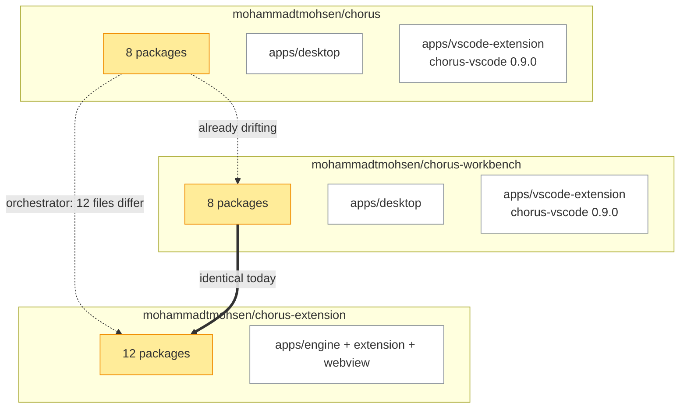
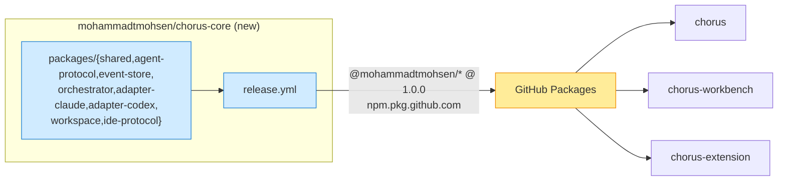
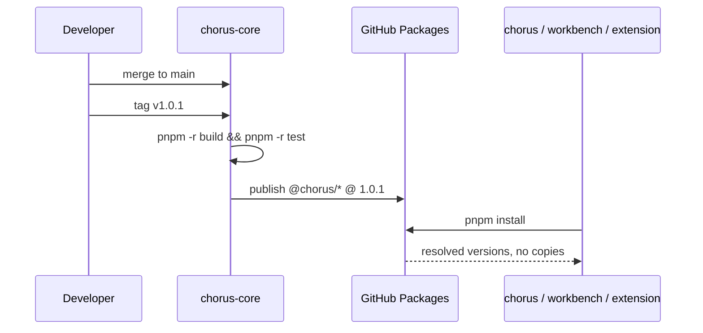

# Shared Core Ownership

Decided 2026-09-24 in `01-chorus-extension.md`. The extension is the primary coding
interface, and the core becomes one shared package set rather than a copy per product.

This plan is written from `chorus-extension` because that is where the decision was taken and
where `docs/core-provenance.md` lives. It belongs to `chorus-core` once that repository exists.

## Current / Issue



Not one problem but four. Three copies of the eight packages. Two copies of `chorus-vscode`
whose sources have diverged. Two desktop apps. And a fourth consumer — the shipped bridge — that
no decision has yet covered.

| Package | chorus | workbench | extension |
| --- | --- | --- | --- |
| `shared`, `agent-protocol`, `event-store`, `orchestrator`, `adapter-claude`, `adapter-codex`, `workspace`, `ide-protocol` | yes | yes | yes |

Every package in all three repositories declares `private: true`, `version: 0.0.0`, and
`main: ./dist/index.js`. No repository has a `publishConfig`, and each resolves `workspace:*`
only against itself. **There is no mechanism today by which one core could reach another
repository** — which is the thing this plan builds.

`dist/` is gitignored in `chorus-extension`, so a raw git dependency would install a package
whose `main` does not exist. That rules out the cheapest option.

## Proposed



**One repository owns the packages and publishes them; the products depend on published
versions instead of copying.** A new `chorus-core` owns them rather than `workbench`, because
`workbench` is the product a later decision may retire, and an owner that may be retired is not
an owner.

The version line is **1.0.0**, not `0.0.0`. A published package needs a version that can move,
and these are the interfaces three products will consume.

Alternatives considered and rejected:

| Option | Why not |
| --- | --- |
| A git dependency per package | `dist/` is not committed and there is no `prepare` script; the build needs `tsc -b` project references across the whole package set, which a nested git install cannot run |
| Sibling checkouts with `link:` | Works on one machine and nowhere else, and `01-chorus-extension.md` already rejected sibling checkouts and symlinks for the dev build |
| CI drift check only | Three sources of truth made honest, not one source of truth |

### The scope is `@mohammadtmohsen/*`, and that was not free

This plan first named the published scope `@chorus/*`, which reads better and is what the packages
already called themselves. It does not work, and the failure is worth recording because it is not
guessable from the code.

GitHub Packages requires a package's scope to name the **account that owns the repository**. A
`chorus` account exists — `Chorus`, "Chorus Software Solutions", an unrelated organisation with
sixteen public repositories — and it is not this one. The first tagged release passed its tests and
then died at the publish step:

```
📦 @chorus/ide-protocol@1.0.0 → https://npm.pkg.github.com/
[E403] 403 Forbidden - Permission permission_denied:
       The requested installation does not exist.
```

Nothing was stored. The rename to `@mohammadtmohsen/*` — the account that owns
`mohammadtmohsen/chorus-core` — is what made it publish: 125 references in 62 files inside
`chorus-core`. Each consumer renames its own references when it migrates, which is phase 3 onward.

The lesson is narrower than "check the registry first". It is that a scope is a claim on a
namespace someone else may already hold, and the only way to find out is to publish.

العنوان الأولي لهذا الـ plan كان `@chorus/*`، وهو أجمل قراءةً وهو ما كانت الحزم تسمّي به نفسها. لكنه لا يعمل، والفشل يستحق التسجيل لأنه لا يمكن تخمينه من الكود.

يشترط GitHub Packages أن يسمّي scope الحزمة **الحساب المالك للـ repository**. ويوجد حساب باسم `chorus` — هو `Chorus`، "Chorus Software Solutions"، منظمة لا علاقة لها بنا وفيها ستة عشر repository عاماً — وهو ليس حسابك. وقد نجح أول إصدار موسوم في اختباراته ثم مات عند خطوة النشر:

```
📦 @chorus/ide-protocol@1.0.0 → https://npm.pkg.github.com/
[E403] 403 Forbidden - Permission permission_denied:
       The requested installation does not exist.
```

ولم يُخزَّن شيء. وإعادة التسمية إلى `@mohammadtmohsen/*` — الحساب المالك لـ `mohammadtmohsen/chorus-core` — هي ما جعل النشر ينجح: 125 مرجعاً في 62 ملفاً داخل `chorus-core`. وكل مستهلك يعيد تسمية مراجعه عند ترحيله، أي من المرحلة الثالثة فصاعداً.

والدرس أضيق من "تحقّق من الـ registry أولاً". إنه أن الـ scope ادّعاء على namespace قد يملكه غيرك، والسبيل الوحيد لمعرفته هو أن تنشر.

## Code Changes

### `chorus-core/packages/*/package.json`

```json
{
  "name": "@mohammadtmohsen/shared",
  "version": "1.0.0",
  "private": false,
  "publishConfig": {
    "registry": "https://npm.pkg.github.com",
    "access": "restricted"
  },
  "main": "./dist/index.js",
  "types": "./dist/index.d.ts",
  "files": ["dist"],
  "scripts": {
    "build": "tsc -b tsconfig.build.json",
    "prepare": "tsc -b tsconfig.build.json"
  }
}
```

`prepare` is not decoration. It is what makes the artefact build on any path that clones the
package, and its absence is the reason a git dependency cannot work today.

### `chorus-core/.github/workflows/release.yml`

```yaml
name: Release

on:
  push:
    tags: ['v*']

jobs:
  publish:
    runs-on: ubuntu-latest
    permissions:
      contents: read
      packages: write
    steps:
      - uses: actions/checkout@v4
      - uses: pnpm/action-setup@v4
      - uses: actions/setup-node@v4
        with:
          node-version: 22
          registry-url: https://npm.pkg.github.com
      - run: pnpm install --frozen-lockfile
      - run: pnpm -r build
      - run: pnpm -r test
      - run: pnpm -r publish --no-git-checks
        env:
          NODE_AUTH_TOKEN: ${{ secrets.GITHUB_TOKEN }}
```

Every package publishes in dependency order, which pnpm resolves. `pnpm -r test` is the gate: a
tag that fails a package's tests publishes nothing.

### `chorus-extension/.npmrc`

```
@mohammadtmohsen:registry=https://npm.pkg.github.com
//npm.pkg.github.com/:_authToken=${GITHUB_TOKEN}
hoist=false
strict-peer-dependencies=false
node-linker=isolated
```

The token is never written to the file — it is read from the environment, so a checked-in
`.npmrc` carries no credential. The three existing lines stay: `hoist=false` and
`node-linker=isolated` are what mechanically enforce the layering.

### `chorus-extension/packages/shared/package.json`

```json
{
  "name": "@mohammadtmohsen/shared",
  "version": "1.0.0",
  "dependencies": { "zod": "^4.1.0" }
}
```

The package's `src/` is deleted and the dependency points at the registry. `workspace:*` is
removed for the eight shared packages and kept for the four this repository owns, so the
layering still holds inside each product.

### `chorus-extension/docs/core-provenance.md`

```markdown
## Superseded 2026-09-24

The import recorded below was correct for the prototype and is now the historical record.
`@chorus/*` is consumed from GitHub Packages at 1.0.0; the blob ids and sha256 below describe
the revision `chorus-core` was seeded from, not what any product depends on today.
```

The provenance record is not deleted. It is the evidence for how `chorus-core` was seeded, and
deleting it would lose the only record of which revision each file came from.

## Not in this plan

| Deferred | To |
| --- | --- |
| `chorus-vscode`, its two drifted copies, and whether the shipped 0.9.0 bridge survives the extension becoming the coding interface | Its own plan |
| Retiring `workbench` | Its own plan, per the decision recorded in `01-chorus-extension.md` |
| The 12 differing `orchestrator` files, read one at a time to separate deliberate product divergence from age | The first phase below, not a plan |
| `transcript`, `transport`, `collaboration-protocol`, `collaboration-runtime` | Unshared. `chorus` carries its coordinator inline; sharing it would mean extracting that from a shipping product |

## Final Flow



A fix lands once and every product picks it up on its next install. That is the whole point, and
it is also the cost: a change to `orchestrator` now reaches three products, so its tests matter
more than they did when a mistake could only break one repository.

## Phases

**1. Seed.** Create `chorus-core` and move the eight packages in from `chorus-extension`, which is
byte-identical to `workbench` today and carries the provenance record.

**2. Publish.** `1.0.0` to GitHub Packages. Prove a clean checkout of a consumer resolves it.

**3. Migrate the two identical consumers.** `chorus-extension` first, because it is the smallest
and least shipped. Then `workbench`. Neither needs a byte of reconciliation — both are the tree
that was seeded.

**4. Reconcile, then migrate `chorus`.** Deliberately after the first release rather than before
it. The measurement is 253 hunks across 37 files, and the drift runs both ways: this side has
`handoff.ts`, `ledger.ts`, `projects.ts`, `editor-tool.ts` and the `path-safety` guards that
`chorus` lacks, while `chorus` has `ambient-context.test.ts`, `supervisor.ts` changes and content
in `conversation-service.ts` this side lacks. Read each hunk and classify it — deliberate product
divergence, or age — before the chat app adopts the core. `chorus` keeps its own copy until then,
so waiting drops nothing; gating the first release on it would have held two consumers behind
work only the third one needs.

**5. Delete the copies.** A copy left behind is the drift this plan exists to end.

